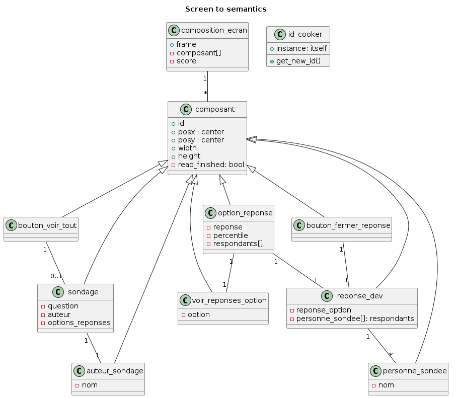

# CMScraper : computer vision based scraper for polls in FB groups

## Quick recap

### What is it?
CMScraper is designed as a mean to automatically gather data from polls on FB groups. It is being developed to tackle the tedious task of collecting data by hand to analyze polls results as a non admin.

### What is it not?
- A general purpose scraper for FB or anything else
- A spam bot that can post in groups or perform any other action besides viewing specific aspects

### How does it work?
CMScraper works by viewing pages like an human: althoug FB has put considerable means into obfuscating the code of its pages to prevent scraping with a simple regex, its human interface is rearkably clear and readable. As such, it can be read by a robot using basic computer vision techniques and minimal training. The robot can then extract the semantic parts of the page, and navigate it simulating a classic mouse pointer.

## Design
CMScraper relies on YOLOv8 for semantic segmentation of the interface it sees, and simple Python to handle the logic. The polls are stored in a JSON file, and specific names of people are put in a database to prevent multiplying persons in case of an OCR bug.
YOLOv8 has been trained on ~100 manually annotated frames: the training datasets are not shared for obvious privacy reasons, but the weights are given. After reading the frames and detecting the interessant parts, some tests are performed to verify the integrity of the detected poll to prevent a degradation of resulting data integrity.

### Simplified algorithm
```
Read the screen and give a frame
If we see a complete poll (minimal height)
    If "see all" detected, click on it

    Read the author, the poll text and the answer options
    Verify the poll is coherent:
        There is 1! author
        There is 1+ answer options
        For each answer options:
            There is a button
            If not, we consider the option as invalid
        
    Add the poll to the json

    For each answer option
        Click to see the participants (interpolate theorical and detected button zone)
        As long as there are changes on the answer box:
            Detect answers
            Scroll box
        
        Close box
    
    Scroll not to see the poll

If it is incomplete:
    Scroll some more

TODO : implement exceptions when the poll is too long (no more head, only answers)

```

### Class diagram

